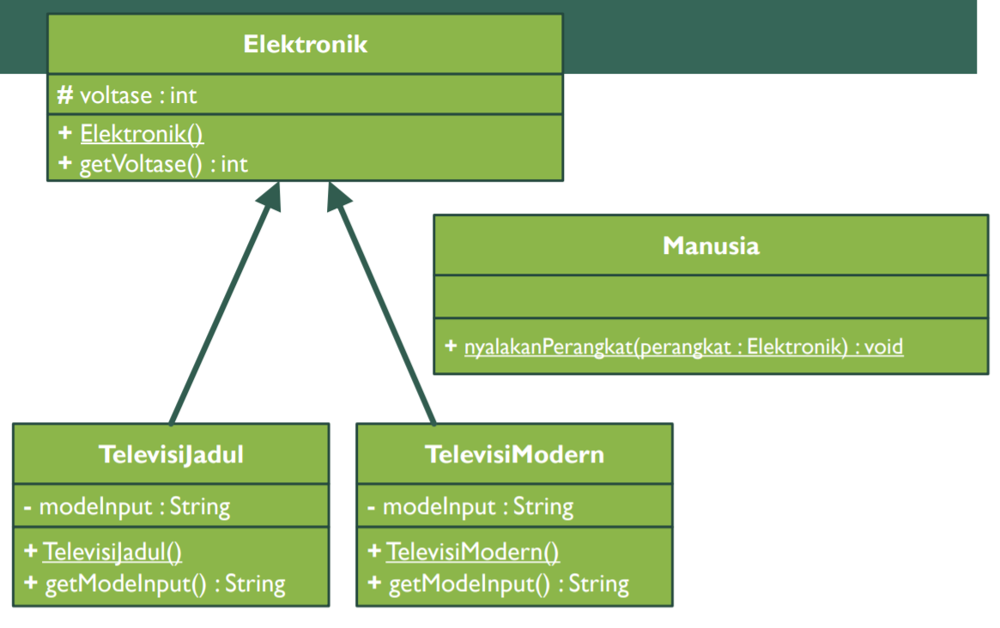

### Teori PBO 11
This is the eleventh repository from PBO Theory in State Polytechnic of Malang. It is coded with Java Programming language. implements Polymorphism from given class diagram in Jobsheet.

- 📝 Pdf filename :[2C_24_Yudas Malabi.pdf](https://github.com/Yudas1337/Teori_PBO_11/blob/master/2C_24_Yudas%20Malabi.pdf)

### Main Topic : Polymorphism
### Class Diagram : 

### Exercise 1 :
<ul>
  <li>Bayaran : Representing Bayaran class</li>
  <li>Manajer : Representing Manajer class</li>
  <li>Pegawai : Representing Pegawai class</li>
  <li>Programmer : Representing Programmer class</li>
  <li>TestBayaran : Representing TestBayaran class</li>
</ul>

### Exercise 2 :
<ul>
  <li>Elektronik : Representing Elektronik class</li>
  <li>Manusia : Representing Manusia class</li>
  <li>TelevisiJadul : Representing TelevisiJadul class</li>
  <li>TelevisiModern : Representing TelevisiModern class</li>
  <li>TestElektronik : Representing TestElektronik class</li>
</ul>

### Technologies :
<ul>
<li>Java Object Oriented Programming</li>
<li>IDE : Visual Studio Code with java plugins for compiler</li>
</ul>

### Credits : Yudas Malabi 😄✌️
